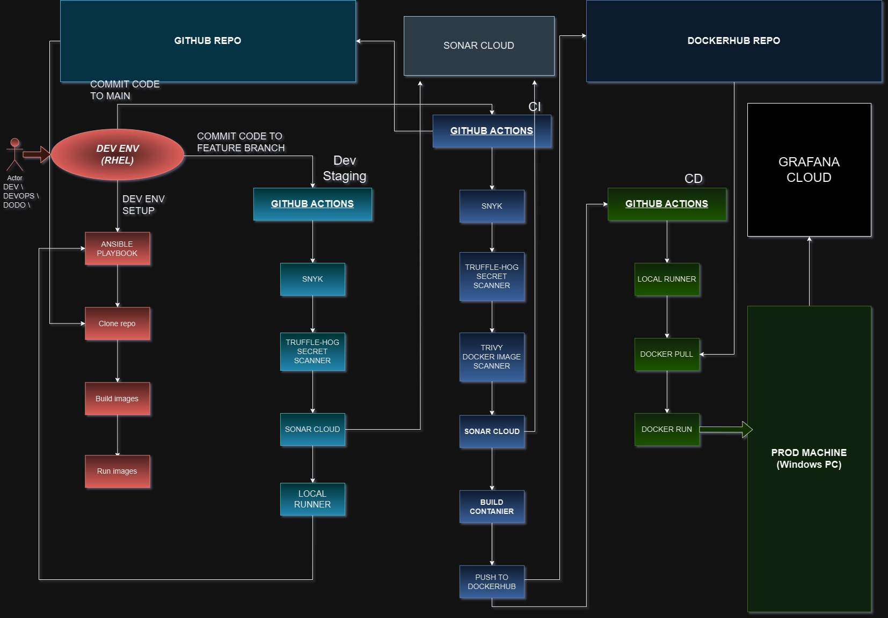

# Lila-dev - the LiChess dev environment

**Based on (but not forked from) https://github.com/lichess-org/lila**

Lila-dev is the containerized version of the popular and open source chess server - Lichess.

The repository contains the source code of Lichess and the Dockerfiles needed for the building and deployment of the application. On top of that, the repo relies on a flow of GitHub actions that scans the code for exposed credentials and vulnerabilities, sends reports to SonarCloud and then builds, scans and pushes the container images to DockerHub from where they are pulled and finally deployed on a local machine/server via a self-hosted runner. Additionally, there's a separate flow for devevlopment purposes, that goes through the same security checks, but rather than deploy the containers from Dockerhub, it clones the repo and builds the containers directly from their Dockerfiles via an Ansible playbook. This allows for an easy refresh of the dev, so changes to sourcecode and/or Dockerfiles can be tested quickly and without hindering the stable state of the containers on Dockerhub. On push to main (or merge), the workflow deploys directly to the "prod" server, on push to feature - it deploys on the dev machine for further testing and development.  

## Contaniers

The app is broken down into three separate containers: 
- Lila - the front. The keeper and executioner of most of the source code. Along side it, there's a listener service, that is responsible for the web socket connections between Lila and the rest of the containers. The compilation and the building of the source code happens inside the container.

- Mongo - the DB server. It is essential that the Mongo container is up and running before the Lila image even starts it's build. A part of the building process for the front is to populate the DB with data. 

- Redis - simple server for cached info. Refreshingly simple. 

## CI/CD to "prod"

The strategy for deployment on the external "prod" machine is the following: 
- On push to main or merge the GitHub Actions workflow starts.
- It scans the container for vulnerabilities via SNYK
- It checks the commit for exposed credentials with Truffle HOG
- It analyzes the code and sends a report to SonarCloud
- It builds the container image
- It scans the image with Trivy
- It then sends the image to DockerHub
- The job is then transferred to a local runner on a Windows machine
- The local runner pulls the newly built image from the DockerHub repo
- And finally runs the containers
- The containers and the machines are monitored in Graphana Cloud

* Due to the build process happening at ENTRYPOINT, it takes up to 15 minutes after the container is run for the site to be up and running

## CI/CD to dev env

The strategy for the Dev environment is the following: 
- On push to 'feature' the GitHub Actions workflow starts.
- It scans the container for vulnerabilities via SNYK
- It checks the commit for exposed credentials with Truffle HOG
- It analyzes the code and sends a report to SonarCloud
- The workflow then goes to a local RHEL machine
- The local runner pulls the new code from the repo
- And finally builds and fires up the three containers

## Diagram

## Notes on possible dependencies 

The "prod" machine requires only  Docker and a confgured local GitHub Actions runner.

The DEV env requires Docker and Ansible, along with the Docker modules for Ansible. 

## Notes on the config files for Lila and changes done to original repo:

Error in the original Lichess repo:
./lila/project/Dependencies.scala requires "scalachess" "15.7.4", which does not yet exist. Has to be modified by hand to 15.7.3 in the file, otherwise the sbt run fails.
Scalachess repo can be found here: https://github.com/lichess-org/lila-maven/tree/master/org/lichess/scalachess_3/15.7.3

(this will likely be fixed soon, but still, worth noting as it took me quite a few hours to find)

Additional notes:
Since the app is using different containers for redis and mongodb, the base.conf file in ./lila/conf has to be modified, so it doesn't look for them @ localhost (or 127.0.0.1).

Also, because of the above, the containers have to be started with specified IP addresses, according to the listener config file below. Will be sorted by Ansble and GitHub actions

Listener:
Listener needs additional config file located in: lila/lila-ws/ws-config.conf

Heaps size:
Heap size has to be increased with the arg -J-Xmx4g (whole line is sbt -J-Xmx4g run or sbt -J-Xmx4g run, added in lila-entrypoint.sh), othewise the execution failes due to lack of resources. 
